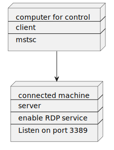
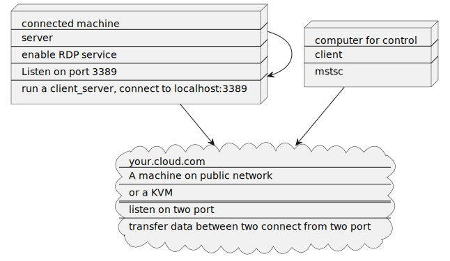

# RDP_relay_server
> Practice projects based on c++20 coroutines and asio

## 1. Introduction
normal RDP server usage:



If you want to use RDP server in a LAN, you need to open the port of the RDP server to the public network.<br>
But most people don't have public internet, or they have one, but not all machines have public internet.
So, we can use a relay server to relay the RDP connection to the RDP server.


So that we can use RDP server in a LAN without opening the port of the RDP server to the public network.<br>
You can use ANY RDP client to connect to ANY of your Windows machine (of course, be prepared in advance).

I think teamviewer and sunflower also use this principle

## 2. Requirements
- C++20 compiler
- CMake
- ASIO 1.24.0

## 3. Build
```bash
mkdir build
cd build
cmake -DASIO_DIR=/path/to/asio_root ..
cmake --build .
```

## 4. Usage
### in your cloud machine
```bash
./rdp_cloud_server <port_in> <port_out>
```

### in your be connected machine
```bash
./rdp_relay_server <cloud_address> <port_out>
```

### in your RDP client
```bash
mstsc /v:<cloud_host>:<port_in>
```

if you have multiple be connected machine, you should run multiple rdp_relay_server in different port_out
